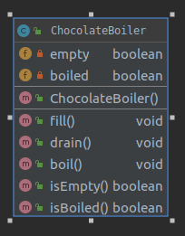
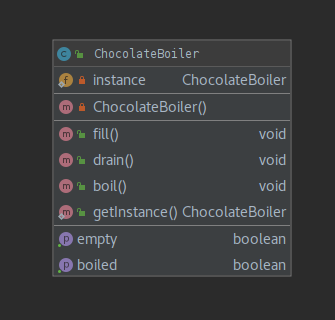

# Singleton Design Pattern
> The singleton is the simplest in terms of its class diagram; in fact, the diagram holds just a single class!

```java
public class Singleton {
  private static Singleton instance;
  // other useful instance variables here
  
  private Singleton() {
  }
  
  public static Singleton getInstance() {
    if (instance == null){
      instance = new Singleton(); 
    }
    return instance;
  }
  
  // other useful methods here
}
```

## Code Up Close

- instance holds our ONE instance, remember, it is a static variable
- if instance is null, then we haven't created the instance yet...
- and if it doesn't exist, we instantiate Singleton throught its private constructor and assign it to unique instance, it never gets created; this is lazy instatiation.
- if instance wasn't null, then it was previously created. We just fall trough to the return statement.

```java
    if (instance == null){
      instance = new Singleton(); 
    }
    return instance;
```
## DONE
- Create a class diagram for current ChocolateBoiler:



- Create a class diagram for Singleton ChocolateBoiler



- Improve ChocolateBoiler class by turning it into a Singleton
.. - Everyone knows that all modern chocolate factories have computer controlled chocolate boilers. The job of the boiler is to take the chocolate and milk, bring them to a boil, and then pass them on to the next phase of making chocolate bars.  Probably suspect that if two ChocolateBoiler instances get loose, some very bad things can happen. How might things go wrong if more than one instance of ChocolateBoilder is created in an application?

- Singleton class solution is [here](src/ChocolateBoiler.java).

- Multithreading the creation of Singleton ChocolateBoiler

- Multihreading the creation is available using [`SimpleThread`](src/SimpleThread.java) class and [`Main`](src/Main.java) class.
